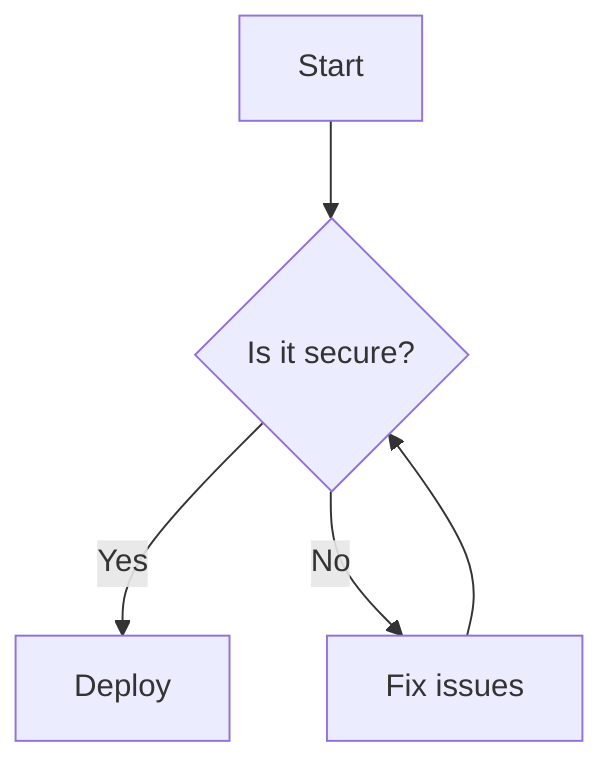

!!! warning "Under Construction"
    This page is under construction. Please check back later for comprehensive guidance


# Documentation Guidelines

This page provides guidelines for writing and formatting documentation for the Google Security Suite. Following these guidelines ensures consistency across the documentation and makes it easier for users to navigate and understand the content.

## General Writing Guidelines

- **Be concise**: Use simple, clear language and avoid unnecessary words.
- **Use active voice**: Active voice is more direct and easier to read (e.g., "Enable MFA" instead of "MFA should be enabled").
- **Focus on the user**: Write from the user's perspective, addressing their needs and questions.
- **Provide context**: Explain why a security control is important before explaining how to implement it.
- **Include examples**: Practical examples help users understand and apply concepts.
- **Link related content**: Reference related topics to help users navigate the documentation.

## Document Structure

Each documentation page should follow this general structure:

1. **Title**: Clear, descriptive title that accurately reflects the content
2. **Introduction**: Brief overview of what the page covers
3. **Prerequisites** (if applicable): What users need before implementing this content
4. **Main Content**: Organized into logical sections with clear headings
5. **Examples**: Practical examples of implementation
6. **Troubleshooting** (if applicable): Common issues and solutions
7. **Next Steps**: What to do after implementing this content
8. **References**: Links to additional resources

## Formatting Guidelines

### Headings

Use descriptive headings to organize content:

- **H1 (#)**: Page title (only one per page)
- **H2 (##)**: Major sections
- **H3 (###)**: Subsections
- **H4 (####)**: Minor subsections

### Lists

Use bulleted lists for unordered items and numbered lists for sequential steps:

```markdown
- Item 1
- Item 2
- Item 3

1. First step
2. Second step
3. Third step
```

### Code Blocks

For code samples, command-line examples, or configuration files, use code blocks with appropriate language specification:

````markdown
```bash
gcloud organizations add-iam-policy-binding $ORG_ID \
    --member=user:email@example.com \
    --role=roles/resourcemanager.organizationAdmin
```
````

### Tables

Use tables to present structured data:

```markdown
| Role | Description | Permissions |
| ---- | ----------- | ----------- |
| Admin | Full access | Read, Write, Delete |
| Editor | Can modify | Read, Write |
| Viewer | Read-only | Read |
```

## Using Admonitions

Admonitions (callouts) help highlight important information in your documentation. Material for MkDocs provides a variety of admonition types that can be used to call attention to specific content. Use them strategically to draw attention to critical points.

### Basic Admonition Types

!!! note "Note"
    Use notes for additional information or context that may be helpful.

!!! info "Information"
    Use for general information and helpful details that users should know.

!!! tip "Tip"
    Use tips for best practices or optimization advice.

!!! success "Success"
    Use to highlight successful operations or positive outcomes.

!!! warning "Warning"
    Use warnings for potential issues that users should be aware of.

!!! danger "Danger"
    Use danger admonitions for critical security risks or destructive actions.

!!! example "Example"
    Use examples to illustrate practical implementation.

!!! question "Question"
    Use for FAQs or addressing common questions.

!!! abstract "Summary"
    Use for summarizing complex information or key points.

!!! bug "Bug"
    Use to document known bugs or issues with a feature or system.

!!! quote "Quote"
    Use for highlighting quotations or important statements.

!!! failure "Failure"
    Use to indicate failed operations or negative outcomes.

### Custom Admonitions

We've also set up custom admonitions specific to this documentation:

!!! best-practice "Best Practice"
    Use the custom best-practice admonition for Google-specific security recommendations.

!!! msp "MSP Guidance"
    Use the custom MSP admonition for managed service provider specific information.

### Admonition Formatting Options

#### Custom Titles

You can customize the title or remove it entirely:

!!! note "Custom Title"
    This admonition has a custom title instead of the default "Note" label.

!!! warning ""
    This admonition has no title at all (notice the empty quotes).

#### Collapsible Admonitions

Make admonitions collapsible to save space for detailed information:

??? note "Collapsible Note (closed by default)"
    This is a collapsible admonition that is closed by default. Click the arrow to expand.
    
    ```python
    def hello_world():
        print("Hello, world!")
    ```

???+ note "Collapsible Note (open by default)"
    This is a collapsible admonition that is open by default. Click the arrow to collapse.
    
    ```python
    def hello_world():
        print("Hello, world!")
    ```

#### Nested Admonitions

You can nest admonitions for complex information hierarchies:

!!! note "Nested Admonitions"
    This is an admonition that contains another admonition inside it.
    
    !!! warning
        This is a warning inside a note.
        
        !!! danger
            And this is a danger admonition inside the warning.

#### Admonitions with Code Blocks

Include code samples within admonitions:

!!! example "Code Example"
    ```python
    def calculate_total(items):
        """Calculate the total price of all items."""
        return sum(item.price for item in items)
    ```

#### Admonitions with Lists

Include structured lists within admonitions:

!!! info "Security Checklist"
    Here's a security checklist to follow:
    
    1. Enable MFA for all admin accounts
    2. Review access logs regularly
    3. Implement least privilege access
    4. Enable alerts for suspicious activities
    5. Back up critical data

### When to Use Admonitions

- **Security Risks**: Use warning or danger admonitions to highlight security vulnerabilities or risks
- **Implementation Notes**: Use note admonitions for important implementation details
- **Performance Tips**: Use tip admonitions for performance optimizations
- **Examples**: Use example admonitions to demonstrate real-world scenarios
- **Security Best Practices**: Use best-practice admonitions for Google-specific security recommendations
- **MSP-Specific**: Use MSP admonitions for content specific to managed service providers
- **Version Information**: Use info admonitions for version-specific features

### Creating Admonitions in Markdown

To create a standard admonition:

```markdown
!!! type "Optional custom title"
    Content of the admonition goes here.
    
    Multiple paragraphs can be included.
```

For collapsible admonitions (closed by default):

```markdown
??? type "Optional custom title"
    Content of the collapsible admonition.
```

For collapsible admonitions (open by default):

```markdown
???+ type "Optional custom title"
    Content of the collapsible admonition (open by default).
```

### Best Practices for Using Admonitions

- Use admonitions sparingly to maintain their impact
- Choose the most appropriate admonition type for your content
- Keep admonition content concise and focused
- Ensure nested admonitions have a logical hierarchy
- Use consistent admonition types across the documentation for similar content

## Images and Diagrams

Use images and diagrams to illustrate complex concepts:

- **Screenshots**: Include screenshots for UI-based instructions
- **Diagrams**: Use Mermaid diagrams for architecture or process flows
- **Alt Text**: Always include descriptive alt text for accessibility

### Mermaid Diagrams

Use Mermaid for creating diagrams directly in Markdown:

````markdown

````

## Version Information

When documenting features that are version-specific:

!!! info "Version Information"
    This feature is available in Google Workspace Enterprise Plus and Education Plus editions.

## Documentation Examples

### Security Control Implementation

Here's an example of documenting a security control:

```markdown
# Data Loss Prevention in Google Drive

## Overview

Data Loss Prevention (DLP) helps prevent the unauthorized sharing of sensitive information in Google Drive.

## Prerequisites

- Google Workspace Enterprise Plus or Education Plus edition
- Admin privileges in Google Workspace

## Implementation Steps

1. Access the Google Admin console
2. Navigate to Security > Data Protection
3. Configure DLP rules

!!! warning
    DLP rules only apply to newly created content after the rule is implemented.

## Example Configuration

```yaml
rules:
  - name: "Credit Card Information"
    pattern: "[0-9]{16}"
    action: "block_sharing"
```

## Troubleshooting

!!! tip
    If rules aren't being applied, check that the content was created after the rule was implemented.
```

## Page Metadata and Git Integration

Each page includes comprehensive metadata and Git repository information at the bottom:

### Git Repository Features

- **Last Updated**: Shows when the page was last modified, with the exact date
- **Page Authors**: Displays all contributors to the page based on Git history
- **Star Repository**: Button to star the GitHub repository
- **View Source**: Direct link to view the page source on GitHub
- **Edit Page**: Quick link to edit the page on GitHub
- **Report Issue**: Button to open a new issue for the page
- **Feedback Buttons**: "Was this page helpful?" feedback section

These features help make the documentation more collaborative and maintainable.

### Using Page Metadata in Front Matter

You can specify additional metadata in the page front matter:

```yaml
---
title: Document Title
description: A brief description of the document
authors:
  - name: John Smith
    email: john@example.com
  - name: Jane Doe
    email: jane@example.com
date: 2023-01-15
---
```

The `authors` field will display those names in the page footer. If omitted, the Git commit history will be used to determine authors automatically.

### Benefits of Git Integration

- **Transparency**: Users can see when content was last updated and by whom
- **Contribution**: Easy paths for users to contribute improvements
- **Feedback**: Multiple channels for users to provide feedback
- **Accountability**: Clear record of who authored and modified content

### Setting Up GitHub Token for Contributor Information

To display contributor information locally (avatars and names), you'll need to set up a GitHub personal access token:

1. Create a GitHub personal access token at [https://github.com/settings/tokens](https://github.com/settings/tokens)
2. For public repositories, only the `public_repo` scope is needed
3. Copy the `.env.example` file to `.env`
4. Add your token to the `.env` file:
   ```
   MKDOCS_GIT_COMMITTERS_APIKEY=your_github_token_here
   ```
5. The `.env` file is ignored by Git and won't be committed

!!! note
    Contributor information will still display when deployed even without a local token configured, as the CI/CD pipeline will have its own token for this purpose.

## Additional Resources

For more comprehensive guidance on technical writing, refer to:

- [Google Developer Documentation Style Guide](https://developers.google.com/style)
- [Material for MkDocs Documentation](https://squidfunk.github.io/mkdocs-material/)